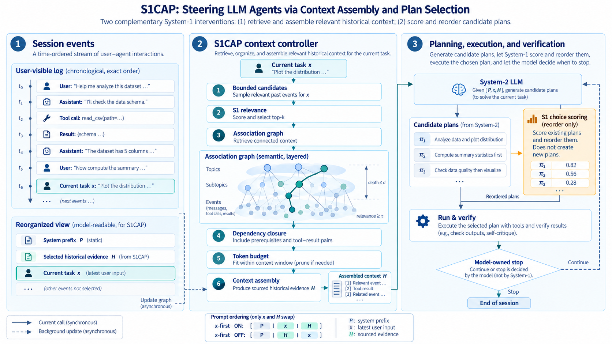

# S1CAP

**S**ystem-**1** **C**ontext-**A**ware **P**lanning

  

**Implementation update:** context delivery now restores only content missing from the actual DSH model-visible
surface, and fully visible history skips recall scoring. Demand scoring uses bounded concurrency and reuses paid
pairs across window changes. See [the optimization report](docs/OPTIMIZATION-20261004.md) for correctness fixes,
reproducible offline measurements, and limitations; the older progress notes below describe earlier implementations.

**S1CAP: Context-Aware Planning via System-1 Models for Efficient LLM Agents**

**Authors:** Yuanming Chen · LI Changzhe

**Progress:** M0 complete (packages, Laya runtime verified on this machine, the plugin activates in a real DSH
profile). **M1 observation mode is live and verified in real sessions**: the per-call pipeline runs
(SEGMENTER → RECALL → ASSEMBLER) with the prompt returned untouched, the system prompt is sourced from the
harness registry so the pinned block and the cache-stable prefix are non-zero (`blocks.pinned = 684` in a real
round), association-graph upkeep is fed by real `session/event` traffic, and a replay harness reproduces the
control-plane records byte for byte. The settings panel that will hold the Jev key is next. Details, evidence
and per-item acceptance tests: [`docs/STATUS.md`](docs/STATUS.md).

S1CAP puts a cheap **System-1 decision model** (Jev / Laya / Kev class, speaking the [`/v1/systemone`](https://docs.typesafe.ai/api) protocol) in charge of an LLM agent harness's **context lifecycle** — instead of the expensive System-2 LLM. The S1CAP control layer intervenes at exactly **two points**. One bound on both, stated here because it decides how every measurement below is read: no cell delivers an assembled *layout* yet — the model-view write-back is a 🔜 row in [`docs/ARCHITECTURE.md`](docs/ARCHITECTURE.md) (`packages/proxy`, not written) — so the ordering is **recorded** and what reaches the model today is recall selection plus one inserted block:

1. **Context Awareness** *(what the model sees, per LLM call)* — every session segment (user turn, assistant message, reasoning trace, tool call/result) is a node in a growing **association graph**, and the pairs between them are scored by the System-1 model **on demand**: a step's recall asks for the rows its walk needs (`AssociationGraph.recallDemand`, 2026-10-05), so a branch the walk never reaches is never scored. Each turn, bounded BFS + relevance threshold + token budget decide which segments make it in, assembled in Trace-as-State order: `[pinned prefix | state proxy T | recent tail | recalled blocks | current input]`. Which half of that reaches the model today is stated in **Evaluation design** below: the *selection* does, the *assembled order* does not yet.
2. **Plan Ordering** *(the context-aware part of planning)* — the LLM's candidate plans go directly to a second System-1 backend that scores them as a **choice question**; **PLAN GATE** normalizes those scores, orders the plans and caps attempts, and execution follows that order under a verification oracle, with unexecuted alternatives discarded on first success. *Designed and implemented, but not wired into any ablation cell as of 2026-10-02:* round `20261002-2037` recorded no `plan_gate` event at all, because the model wrote no numbered plan and emitted no `todo/write`, so the knob was removed from the policy, the presets and the report rather than left `on` and inert (`packages/core/src/types.ts`).

Everything is **measured, not assumed**: solve rate, token cost split by prompt-cache **hit/miss** (the dominant cost lever — cache-hit tokens are ~50× cheaper than misses on DeepSeek), and wall time excluding approval waits. The definitions are [`docs/FORMULAS.md`](docs/FORMULAS.md), and [`scripts/cell-report.mjs`](scripts/cell-report.mjs) is their one implementation.

## Why now (September 2026)

| enabler | fact |
|---|---|
| Trace as State ([arXiv:2609.02702](https://arxiv.org/abs/2609.02702)) | placing the reasoning-trace state proxy **before** the long context beats trace-append in 26/27 model×task×metric combos — training-free, inference-time only |
| Decision models arrive | [Jev](https://docs.typesafe.ai/api) (TypeSafe AI): $0.042/M input, output free, parallel question batches 12× cheaper than serial · open [Laya](https://github.com/NandhaKishorM/laya) (Apache-2.0) · [EdgeJev](https://github.com/yzfly/edgejev) local runtime: 322M INT8, 324 MB, 15.6 ms/decision on 4 vCPU |
| Cache economics | DeepSeek `deepseek-flash`: $0.006/M cache-hit vs $0.30/M cache-miss — context assembly is a cost decision, not just a quality decision |

## Architecture



For exact control flow and asynchronous boundaries, see the [detailed technical route](docs/figures/s1cap-technical-route.light.svg) ([dark version](docs/figures/s1cap-technical-route.dark.svg)).

The user-facing transcript stays **strictly chronological**; only the model view is reassembled — and that write-back is a 🔜 row in [`docs/ARCHITECTURE.md`](docs/ARCHITECTURE.md) (`packages/proxy`, not written), so what the *ordering* half records is not yet what the model reads. The one live delivery channel inserts the `recalled` turns and nothing else, which is why the registered contrast measures the recall lane rather than TAS (`docs/CELLS-RUN.md`).

## Evaluation design (three cells)

Three cells are run: two controls and one arm under test (the 2×2 crossing's fourth combination — governance without
ordering — measured worse than the baseline per step and has been dropped; `bench/README.md` records the quantities).
**Which switches an arm carries is owned by the presets and the policy, not by this page:** the arm definitions are
[`bench/cells/C0.json`](bench/cells/C0.json)–[`C2.json`](bench/cells/C2.json) plus `cellPolicy()`
(`packages/core/src/types.ts`), and a disagreement with this page is a reason to read those. What the three arms mean
is the rule this page keeps:

- **`C0`** is the baseline and **`C2`** the full configuration; **`C1`** is a **second control arm** — delivery has one
  channel and its `tier1: off` leaves that channel empty by construction, so its model-visible input is `C0`'s.
- **The layout variable is `tracePlacement` alone** — which of the paper's two arms the recorded order is: **TAS**, the
  trace before the long context, against its Trace Append control. It is *recorded* in every arm, and the assembled
  *order* reaches the model in none: delivery appends the trace `T` and the recalled turns and never a layout, so the
  ordering becomes measurable only with the model-view write-back, which does not exist
  ([`docs/ARCHITECTURE.md`](docs/ARCHITECTURE.md) §5; `packages/proxy` is not written). The question is not a second
  axis and not a setting: the paper holds `q` last in every condition, so it is the last block of every layout by
  construction. Values and defaults are code-owned: `bench/cells/*.json` + `cellPolicy()`
  (`packages/core/src/types.ts`).
- The registered contrast is therefore **`C0` vs `C2`**, and what it measures today is recall selection and its
  insertion — the recall lane, not TAS.
- Factor B is recall selection alone: the plan gate is designed and unit-tested but **wired into no cell**, so it is no
  part of any factor here.

Benchmarks (all automated scoring, no GUI, no LLM judges): **SWE-bench Verified** · **Terminal-Bench 4.0** ·
**τ²-bench**. The pools and their sizes are
[`docs/AGENT_BRIEF.md`](docs/AGENT_BRIEF.md) §"Experiment design (three arms: two controls, one arm under test)",
and the per-round run set is [`docs/CELLS-RUN.md`](docs/CELLS-RUN.md). Model: `deepseek-flash`
(DeepSeek-V4.1-Flash) with `reasoningEffort` pinned; **no sampling parameter is claimed** — not a temperature and not a seed — because DSH exposes none.

**Success rule:** solve-rate **non-inferiority** vs C0 (paired McNemar, one-sided α=0.05, margin −2 pp) **AND** ≥10% improvement in cost/task or time/task (paired bootstrap 95% CI excluding 0, Holm-corrected). Winning cost while losing >2 pp solve rate is not a win. The frozen rule is
[`docs/AGENT_BRIEF.md`](docs/AGENT_BRIEF.md) §"Metrics, hypotheses, success rule"; its pools, grid and budget are
[`docs/AGENT_BRIEF.md`](docs/AGENT_BRIEF.md) §"Experiment design (three arms: two controls, one arm under test)".

## Status & roadmap

Pre-alpha — **M0 scaffolding landed**: monorepo, `@s1cap/core` (segmenter · association graph · assembler · plan gate · telemetry v1), `@s1cap/s1-client`, `@s1cap/laya-runtime` (Python discovery + `laya-serve` launcher), `dsh-s1cap` skeleton, three-cell presets (C0–C2); the offline suite is green (`node --test`, below), and a real `laya-serve` round trip verified (`/health` readiness + a `noul` decision over `/v1/systemone`). Remaining M0: live-backend smoke against Jev. Full spec: [docs/AGENT_BRIEF.md](docs/AGENT_BRIEF.md).

| M | Scope |
|---|---|
| M0 | monorepo scaffold, core + `s1-client`, telemetry v1, DSH plugin skeleton — **scaffold done**, live-backend smoke pending |
| M1 | assembler/recall replay-correctness tests, proxy MVP, DSH hook wiring (`agent/pre-step`, surface ops) |
| M2 | plan gate wiring (a cell can only fire the gate once its model writes a plan the gate can read — none does today), degradation paths, settings UI, Terminal-Bench 10-task cost pilot |
| M3 | three-cell ablation on SWE-bench Verified + τ²-bench (+ TB), optional Laya fine-tune |
| M4 | Terminal-Bench cells, opencode transfer check, GLM model-swap check |
| M5 | paper: Pareto + cache-waterfall figures, case studies, LaTeX draft |

## Development

```bash
node --test --experimental-strip-types "packages/*/test/*.test.ts"   # zero dependencies, offline
node scripts/check-diagram.mjs   # every node box inside its lane band, no overlapping nodes
node scripts/check-doc-pointers.mjs   # dead file/section pointers and stale value claims
```

The second command guards the hand-authored route diagram: it is drawn by hand, so nothing but this
check stops a node from drifting out of its lane.

Local Laya backend: `@s1cap/laya-runtime` discovers the Python environment that can `import laya`
(conda environments are resolved through `conda env list --json`, never by guessing paths), launches
`laya-serve` and health-checks `/v1/models`. Install the serving extra once per environment with
`<python> -m pip install "laya[serve]"`; configuration keys and the DSH profile patch are documented in
[docs/LAYA_RUNTIME.md](docs/LAYA_RUNTIME.md).

The workspace pins TypeScript and Node types as development dependencies. After `pnpm install --frozen-lockfile`,
run `pnpm typecheck`, `pnpm build`, and `pnpm test`; `node scripts/check-lib-fresh.mjs` verifies the shipped JavaScript matches the sources.
pnpm is the intended workspace manager; on Windows PowerShell call `pnpm.cmd` (the `.ps1` shim is blocked by
the default execution policy).

## Repository layout

```
s1cap/
  packages/core        # segmenter, association graph, assembler, plan gate, telemetry v1
  packages/s1-client   # /v1/systemone client + provider matrix
  packages/proxy       # OpenAI-compatible middleware (M1)
  packages/dsh-plugin  # dsh-s1cap: first-class DeepSeek Harness plugin (skeleton)
  bench/               # cells/ presets; runners + stats land with M2
  docs/                # proposal, implementation brief, related-work dossier, formulas
  paper/               # LaTeX (M5)
```

## Documentation

| doc | audience |
|---|---|
| [docs/STATUS.md](docs/STATUS.md) | **start here** — done/next checklist plus agent-ready detail for every open item |
| [docs/PROPOSAL.md](docs/PROPOSAL.md) | research proposal — supervisor / cooperator |
| [docs/ARCHITECTURE.md](docs/ARCHITECTURE.md) | module reference: route SVG + connection semantics, parameters, implementation status |
| [docs/LAYA_RUNTIME.md](docs/LAYA_RUNTIME.md) | local Laya backend: Python environment discovery, launcher, configuration keys |
| [docs/CONTROL_PLANE_LOGGING.md](docs/CONTROL_PLANE_LOGGING.md) | control-plane isolation: two-log design and the invariants that keep System-1 from scoring its own output |
| [docs/AGENT_BRIEF.md](docs/AGENT_BRIEF.md) | implementation brief for coding agents — verified facts base, interfaces, algorithms, milestones |
| [docs/FORMULAS.md](docs/FORMULAS.md) | formal definitions and formula handbook (Markdown + LaTeX) |
| [docs/RELATED_WORK.md](docs/RELATED_WORK.md) | verified related-work dossier + novelty audit |
| [docs/REPO_METADATA.md](docs/REPO_METADATA.md) | canonical repo description, topics, keywords |

## Environment

Verified on the dev machine (2026-09-28): Node v22.23.1 · npm 12.0.2 · git 2.45.2 · Python 3.13.13 (miniforge) · i7-12700H (AVX2 — EdgeJev-compatible) · DSH runtime bundles Node 24.18.1.

Requirements: Node ≥ 22.19 (DSH plugin engines contract) · pnpm for the monorepo (on Windows PowerShell, invoke `pnpm.cmd` or relax the execution policy) · Python ≥ 3.10 for local S1 runtimes (`pip install "laya[serve]"`, `pip install edgejev`) · a System-1 backend: cloud Jev key, or local EdgeJev/Laya for weak CPUs (324 MB, offline).

## Name

**S1CAP = System-1 Context-Aware Planning** — `S1` is the System-1 decision model, `C-A-P` is the context-aware planning it performs for an LLM agent. The control layer intervenes at two points: **① Context Awareness** (which segments the model sees) and **② Plan Ordering** (the order its own plans run in).

## Acknowledgments

[TypeSafe AI](https://typesafe.ai/) (Jev) · [Convai Innovations](https://github.com/NandhaKishorM/laya) (Laya) · [yzfly](https://github.com/yzfly/edgejev) (EdgeJev) · [jaredpalmer](https://github.com/jaredpalmer/kev) (Kev) · [Benchmark Heaven](https://www.benchmarkheaven.com/jev-models) (JevBench) · Xu Zou & Jie Tang (Trace as State, arXiv:2609.02702) · [snailium](https://github.com/snailium/dsh-command-context-trim) (DSH plugin engineering template) · [DeepSeek Harness](https://github.com/deepseek-ai/deepseek-harness)

## Citation

Paper in preparation. Authors: **Yuanming Chen**, **LI Changzhe**. Title: *S1CAP: Context-Aware Planning via System-1 Models for Efficient LLM Agents* (revised 2026-09-28 after the naming erratum: the acronym expands to System-1 Context-Aware Planning).

```bibtex
@misc{s1cap2026,
  title  = {S1CAP: Context-Aware Planning via System-1 Models for Efficient LLM Agents},
  author = {Chen, Yuanming and LI, Changzhe},
  year   = {2026},
  url    = {https://github.com/Jaffe2718/s1cap},
  note   = {Paper in preparation}
}
```

## License

TBD (MIT proposed).

## Correction 2026-10-05 — the layout axis was deleted, and the correction below is what it replaces

Appended under [`docs/DOC-CONTRACT.md`](docs/DOC-CONTRACT.md) §4, beside the correction immediately below it. The
bullet in **Evaluation design** above is a live statement of a current fact, so it was corrected in place; the
superseded wording is carried here verbatim.

**What moved.** `AssemblyPolicy.questionPlacement: 'first' | 'last'` is **deleted** — not renamed. No field places the
question any more. `AssemblyPolicy.tracePlacement: 'trace-as-state' | 'trace-append'` is the only layout axis, and `q`
is the last block of every layout by construction. How an older profile's spelling is read, what is warned about and
what is refused is owned by `LEGACY_LAYOUT_KEYS` in `packages/core/src/config.ts` and is not restated here.

**Why the axis was deleted rather than named better.** The correction below renamed `xFirst` to
`questionPlacement` and left "the question's position is a variable" expressible. The paper (arXiv:2609.02702, §4.1)
places the question **last in every condition** — "We therefore separate the question from the long context and place
it at the end of every input" — and its two arms are `[T, x, q]` (Trace as State) and `[x, T, q]` (Trace Append),
"order as the only difference". `questionPlacement: 'first'` produced `[T, q, x]`, which is neither. A field whose
other value lays out a condition the paper does not have is not a variable, so the axis is gone; a profile that still
spells it is read and reported rather than run (the two spellings and their two outcomes are the code's, above).

**Why the correction below is not enough.** `xFirst` and `questionPlacement` are *the same deleted axis* under two
spellings, not two renames: the first correction described the second spelling as the current field, and any sentence
here that still names it as a setting is wrong about the build. What the trace axis carries is unchanged and is stated
above; what the question axis carried is now a fixed position.

**The evidence, from round `20261004-0233`'s own `layoutOrder` records.** The two TAS cells (`C1`, `C2`) recorded
`pinned, stateProxy, anchor, recalled, tail` — the question second, which is neither paper arm — and `C0` recorded
`pinned, recalled, tail, anchor`, the paper's baseline `M([x, q])`. That first order is no longer producible by any
setting, and the two orders the build does produce are the table in `packages/core/src/assembler.ts`'s header.

**Superseded wording, verbatim.** The correction below claimed that the question had a position field; that claim is
what this note deletes.

> **What moved.** `AssemblyPolicy.xFirst: boolean` is now `questionPlacement: 'first' | 'last'`, and
> `AssemblyPolicy.stateProxyPosition: 'before-context' | 'after-context'` is now
> `tracePlacement: 'trace-as-state' | 'trace-append'`. The mapping is exact — `true` → `'first'`, `false` → `'last'`;
> `'before-context'` → `'trace-as-state'`, `'after-context'` → `'trace-append'` — and a profile that still sets an old
> spelling is translated rather than run as the default (`LEGACY_LAYOUT_KEYS`, `packages/core/src/config.ts`, which
> reports the substitution as a warning).

The **Evaluation design** bullet it also supersedes, verbatim — *"The two layout fields — `tracePlacement` … and
`questionPlacement` (where the question sits) — are *recorded* in every arm … **The question's position is not the
paper's variable** — the paper holds the question last in every condition, so no arm is defined by it."* — is a live
statement, so it was corrected in place rather than carried as history.

**What the correction below still carries, and is not corrected here.** Its **Why** paragraph, its measured evidence,
and its account of the arm bullets under **Evaluation design** are unaffected: the arm registration is a different
correction (see the note at the end of the correction below).

---

## Correction 2026-10-05 — one layout field was renamed; the second was **deleted** (see the correction above)

Appended under [`docs/DOC-CONTRACT.md`](docs/DOC-CONTRACT.md) §4. The bullet in **Evaluation design** above is a live
statement of a current fact, so it was corrected in place; the superseded wording is carried here verbatim. **The
field mapping in "What moved" below is superseded by the correction above** — `questionPlacement` never became the
field this paragraph describes: it was deleted the same day, and the superseded wording is carried in the correction
above. What this paragraph still carries is why the rename happened and what it cost.

**What moved.** `AssemblyPolicy.xFirst: boolean` is now `questionPlacement: 'first' | 'last'`, and
`AssemblyPolicy.stateProxyPosition: 'before-context' | 'after-context'` is now
`tracePlacement: 'trace-as-state' | 'trace-append'`. The mapping is exact — `true` → `'first'`, `false` → `'last'`;
`'before-context'` → `'trace-as-state'`, `'after-context'` → `'trace-append'` — and a profile that still sets an old
spelling is translated rather than run as the default (`LEGACY_LAYOUT_KEYS`, `packages/core/src/config.ts`, which
reports the substitution as a warning). The names, the values and their defaults are owned by
`packages/core/src/types.ts` and `packages/core/src/config.ts`; none of them is restated here.

**Why.** The paper (arXiv:2609.02702, §4.1) places the question **last in every condition** — "the question appears at
the end of the prompt … place it at the end of every input" — and its two arms are `[T, x, q]` (Trace as State) and
`[x, T, q]` (Trace Append), **order the only difference**. `xFirst` moved the *question*, the one element the paper
fixes, and its name presented that as the paper's variable; `stateProxyPosition` was already the paper's axis, so it
took the paper's names.

**What it cost, measured.** Round `20261004-0233`'s own `layoutOrder` records: the two TAS cells (`C1`, `C2`) recorded
`pinned, stateProxy, anchor, recalled, tail` — the question second, which is neither paper arm — because both set
`xFirst: true`; `C0` (`xFirst: false`, TAS off) recorded `pinned, recalled, tail, anchor`, the paper's baseline
`M([x, q])`. With the question where the paper holds it, those layouts are no longer producible, and `tracePlacement`
alone selects between the paper's two arms.

**Superseded wording, verbatim:**

> `tas.on`/`xFirst` are *recorded* in every arm and reach the model in none: delivery inserts one `recalled` block and
> never the assembled order, so the ordering becomes measurable only with the model-view write-back, which does not
> exist ([`docs/ARCHITECTURE.md`](docs/ARCHITECTURE.md) §5; `packages/proxy` is not written).

**Outstanding, and not part of this correction.** The arm bullets under **Evaluation design** — "two controls and one
arm under test", and "`C1` is a **second control arm** … so its model-visible input is `C0`'s" — still state the
registration that `docs/STATUS.md` §10's addendum and the comment above `cellPolicy()` superseded on 2026-10-04 (`C1`
delivers the trace and is the paper's arm). That is a different correction and is left to its own pass.

---

## Correction 2026-10-05 (third) — the recalled block moved behind the tail: a cache fix **inside `x`**, and the paper's arm is unchanged

Appended under [`docs/DOC-CONTRACT.md`](docs/DOC-CONTRACT.md) §4, at the foot of the two corrections above and in place
of neither. One live sentence in **What this is** carried the old order in a literal, so it was corrected in place and
the wording as it stood is carried below verbatim. The **Why.** paragraph of the second correction above is the
sentence the report names: it states the paper's variable and its two arms, it is right as written, and this note is
what a reader of it now needs beside it.

**What moved.** The recalled block now sits **immediately before the last block**, behind the tail — it used to be third
of five, with the recent tail and the current input behind it. The block order each `tracePlacement` value produces is
the table in `packages/core/src/assembler.ts`'s header, and `AssemblyLayout.order` (`packages/core/src/types.ts`) is the
statement of record; neither is restated as a rule here.

**Why the arm did not move with it.** The paper's variable is where the trace `T` sits relative to the long context `x`
— the two arms are `[T, x, q]` (Trace as State) and `[x, T, q]` (Trace Append), order the only difference — and the
recalled block is **part of that long context** (`AssemblyLayout.order`: the current input is `q`, and the blocks
between the pinned prefix and it are the long context the trace is placed around;
`packages/dsh-plugin/src/context-delivery.ts`: "the long context here is the `recalled` block"). A block that moves
*inside* `x` leaves `T`'s side of it where it was: `T` is still ahead of every block of `x` under `'trace-as-state'`
and behind all of them under `'trace-append'`.

**Why the block moved.** A prompt cache is a prefix cache: a change at any token breaks the match from that token to the
end of the prompt, so everything placed behind a block that changes every step is invalidated with it. The recalled
block is the block a re-selection moves; ending `x` with it means a re-selection costs the question and nothing else.
**Measured on round `20261004-1458` C2**: the whole-prompt invalidation span per delivered pair fell from **2,539 to
2,111 tokens** with this move, on top of the ordering change that had already cut it from **6,179 to 2,539**.

**The superseded wording, verbatim.** The **What this is** bullet's order — *"assembled in Trace-as-State order:
`[pinned prefix | state proxy T | recalled blocks | recent tail | current input]`"*. It now reads
`[pinned prefix | state proxy T | recent tail | recalled blocks | current input]`.

**What is left as written.** The dated evidence in the corrections above — round `20261004-0233`'s own `layoutOrder`
records and the orders they name — is that round's data, stays readable and is not edited; the order it records is no
longer producible by any setting, which is what the assembler header table says about it. The **Evaluation design**
sentences about delivery are unaffected: the delivered text is the insertion channel's and did not change with this
move.
