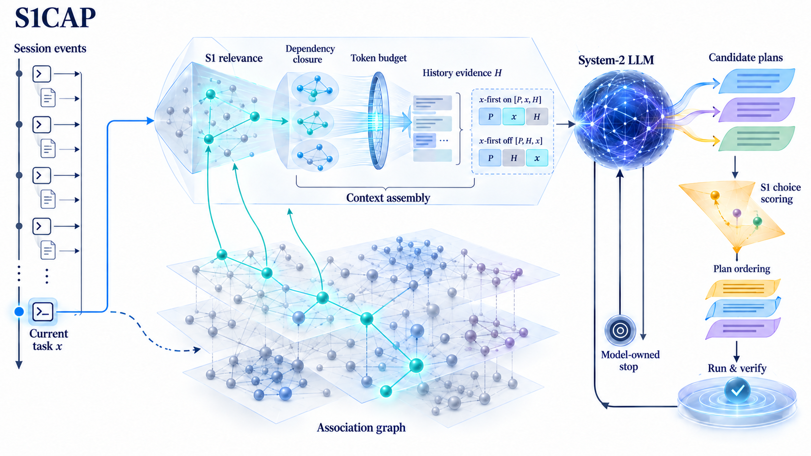

# S1CAP

**S**ystem-**1** **C**ontext-**A**ware **P**lanning

  

**S1CAP: Context-Aware Planning via System-1 Models for Efficient LLM Agents**

**Authors:** Yuanming Chen · LI Changzhe

**Progress:** M0 complete (packages, Laya runtime verified on this machine, the plugin activates in a real DSH
profile). **M1 observation mode is live and verified in real sessions**: the per-call pipeline runs
(SEGMENTER → RECALL → ASSEMBLER) with the prompt returned untouched, the system prompt is sourced from the
harness registry so the pinned block and the cache-stable prefix are non-zero (`blocks.pinned = 684` in a real
round), association-graph upkeep is fed by real `session/event` traffic, and a replay harness reproduces the
control-plane records byte for byte. The settings panel that will hold the Jev key is next. Details, evidence
and per-item acceptance tests: [`docs/STATUS.md`](docs/STATUS.md).

S1CAP puts a cheap **System-1 decision model** (Jev / Laya / Kev class, speaking the [`/v1/systemone`](https://docs.typesafe.ai/api) protocol) in charge of an LLM agent harness's **context lifecycle** — instead of the expensive System-2 LLM. The S1CAP control layer intervenes at exactly **two points**:

1. **Context Awareness** *(what the model sees, per LLM call)* — every session segment (user turn, assistant message, reasoning trace, tool call/result) is a node in a growing **association graph** scored by the System-1 model. Each turn, bounded BFS + relevance threshold + token budget decide which segments make it in, assembled in Trace-as-State order: `[pinned prefix | state proxy T | recalled blocks | recent tail | current input]`.
2. **Plan Ordering** *(the context-aware part of planning)* — the LLM's candidate plans go directly to a second System-1 backend that scores them as a **choice question**; **PLAN GATE** normalizes those scores, orders the plans and caps attempts, and execution follows that order under a verification oracle, with unexecuted alternatives discarded on first success.

Everything is **measured, not assumed**: solve rate, token cost split by prompt-cache **hit/miss** (the dominant cost lever — cache-hit tokens are ~50× cheaper than misses on DeepSeek), and wall time excluding approval waits.

## Why now (September 2026)

| enabler | fact |
|---|---|
| Trace as State ([arXiv:2609.02702](https://arxiv.org/abs/2609.02702)) | placing the reasoning-trace state proxy **before** the long context beats trace-append in 26/27 model×task×metric combos — training-free, inference-time only |
| Decision models arrive | [Jev](https://docs.typesafe.ai/api) (TypeSafe AI): $0.042/M input, output free, parallel question batches 12× cheaper than serial · open [Laya](https://github.com/NandhaKishorM/laya) (Apache-2.0) · [EdgeJev](https://github.com/yzfly/edgejev) local runtime: 322M INT8, 324 MB, 15.6 ms/decision on 4 vCPU |
| Cache economics | DeepSeek `deepseek-flash`: $0.006/M cache-hit vs $0.30/M cache-miss — context assembly is a cost decision, not just a quality decision |

## Architecture



For exact control flow and asynchronous boundaries, see the [detailed technical route](docs/figures/s1cap-technical-route.light.svg) ([dark version](docs/figures/s1cap-technical-route.dark.svg)).

The user-facing transcript stays **strictly chronological**; only the model view is reassembled (native in DSH's session/surface split, replicated by the portable proxy elsewhere).

## Evaluation design (pre-registered)

2×2 within-task paired factorial — factor A: Trace-as-State ordering; factor B: S1 governance (selection + plan gate):

| Cell | A | B |
|---|---|---|
| C1 baseline | off | off (native compaction only) |
| C2 | **on** | off |
| C3 | off | **on** |
| C4 full | **on** | **on** |

Benchmarks (all automated scoring, no GUI, no LLM judges): **SWE-bench Verified** (100/cell) · **Terminal-Bench 4.0** (66/cell) · **τ²-bench** (full base split). Model: `deepseek-flash` (DeepSeek-V4.1-Flash), temperature 0.

**Success rule:** solve-rate **non-inferiority** vs C1 (paired McNemar, one-sided α=0.05, margin −2 pp) **AND** ≥10% improvement in cost/task or time/task (paired bootstrap 95% CI excluding 0, Holm-corrected). Winning cost while losing >2 pp solve rate is not a win.

## Status & roadmap

Pre-alpha — **M0 scaffolding landed**: monorepo, `@s1cap/core` (segmenter · association graph · assembler · plan gate · telemetry v1), `@s1cap/s1-client`, `@s1cap/laya-runtime` (Python discovery + `laya-serve` launcher), `dsh-s1cap` skeleton, 2×2 cell presets; `node --test` **34/34 offline**, and a real `laya-serve` round trip verified (`/health` readiness + a `noul` decision over `/v1/systemone`). Remaining M0: live-backend smoke against Jev. Full spec: [docs/AGENT_BRIEF.md](docs/AGENT_BRIEF.md) §10.

| M | Scope |
|---|---|
| M0 | monorepo scaffold, core + `s1-client`, telemetry v1, DSH plugin skeleton — **scaffold done**, live-backend smoke pending |
| M1 | assembler/recall replay-correctness tests, proxy MVP, DSH hook wiring (`agent/pre-step`, surface ops) |
| M2 | plan gate wiring, degradation paths, settings UI, Terminal-Bench 10-task cost pilot |
| M3 | full 2×2 on SWE-bench Verified + τ²-bench (+ TB), optional Laya fine-tune |
| M4 | Terminal-Bench cells, opencode transfer check, GLM model-swap check |
| M5 | paper: Pareto + cache-waterfall figures, case studies, LaTeX draft |

## Development

```bash
node --test --experimental-strip-types "packages/*/test/*.test.ts"   # 51 tests, zero deps, offline
node scripts/check-diagram.mjs   # every node box inside its lane band, no overlapping nodes
```

The second command guards the hand-authored route diagram: it is drawn by hand, so nothing but this
check stops a node from drifting out of its lane.

Local Laya backend: `@s1cap/laya-runtime` discovers the Python environment that can `import laya`
(conda environments are resolved through `conda env list --json`, never by guessing paths), launches
`laya-serve` and health-checks `/v1/models`. Install the serving extra once per environment with
`<python> -m pip install "laya[serve]"`; configuration keys and the DSH profile patch are documented in
[docs/LAYA_RUNTIME.md](docs/LAYA_RUNTIME.md).

Type-checking needs TypeScript ≥ 5.8 (`erasableSyntaxOnly`): `npm i -D typescript@^5.8 && npm run typecheck`.
pnpm is the intended workspace manager; on Windows PowerShell call `pnpm.cmd` (the `.ps1` shim is blocked by
the default execution policy).

## Repository layout

```
s1cap/
  packages/core        # segmenter, association graph, assembler, plan gate, telemetry v1
  packages/s1-client   # /v1/systemone client + provider matrix
  packages/proxy       # OpenAI-compatible middleware (M1)
  packages/dsh-plugin  # dsh-s1cap: first-class DeepSeek Harness plugin (skeleton)
  bench/               # cells/ presets; runners + stats land with M2
  docs/                # proposal, implementation brief, related-work dossier, formulas
  paper/               # LaTeX (M5)
```

## Documentation

| doc | audience |
|---|---|
| [docs/STATUS.md](docs/STATUS.md) | **start here** — done/next checklist plus agent-ready detail for every open item |
| [docs/PROPOSAL.md](docs/PROPOSAL.md) | research proposal — supervisor / cooperator |
| [docs/ARCHITECTURE.md](docs/ARCHITECTURE.md) | module reference: route SVG + connection semantics, parameters, implementation status |
| [docs/LAYA_RUNTIME.md](docs/LAYA_RUNTIME.md) | local Laya backend: Python environment discovery, launcher, configuration keys |
| [docs/CONTROL_PLANE_LOGGING.md](docs/CONTROL_PLANE_LOGGING.md) | control-plane isolation: two-log design and the invariants that keep System-1 from scoring its own output |
| [docs/AGENT_BRIEF.md](docs/AGENT_BRIEF.md) | implementation brief for coding agents — verified facts base, interfaces, algorithms, milestones |
| [docs/FORMULAS.md](docs/FORMULAS.md) | formal definitions and formula handbook (Markdown + LaTeX) |
| [docs/RELATED_WORK.md](docs/RELATED_WORK.md) | verified related-work dossier + novelty audit |
| [docs/REPO_METADATA.md](docs/REPO_METADATA.md) | canonical repo description, topics, keywords |

## Environment

Verified on the dev machine (2026-09-28): Node v22.23.1 · npm 12.0.2 · git 2.45.2 · Python 3.13.13 (miniforge) · i7-12700H (AVX2 — EdgeJev-compatible) · DSH runtime bundles Node 24.18.1.

Requirements: Node ≥ 22.19 (DSH plugin engines contract) · pnpm for the monorepo (on Windows PowerShell, invoke `pnpm.cmd` or relax the execution policy) · Python ≥ 3.10 for local S1 runtimes (`pip install "laya[serve]"`, `pip install edgejev`) · a System-1 backend: cloud Jev key, or local EdgeJev/Laya for weak CPUs (324 MB, offline).

## Name

**S1CAP = System-1 Context-Aware Planning** — `S1` is the System-1 decision model, `C-A-P` is the context-aware planning it performs for an LLM agent. The control layer intervenes at two points: **① Context Awareness** (which segments the model sees) and **② Plan Ordering** (the order its own plans run in).

## Acknowledgments

[TypeSafe AI](https://typesafe.ai/) (Jev) · [Convai Innovations](https://github.com/NandhaKishorM/laya) (Laya) · [yzfly](https://github.com/yzfly/edgejev) (EdgeJev) · [jaredpalmer](https://github.com/jaredpalmer/kev) (Kev) · [Benchmark Heaven](https://www.benchmarkheaven.com/jev-models) (JevBench) · Xu Zou & Jie Tang (Trace as State, arXiv:2609.02702) · [snailium](https://github.com/snailium/dsh-command-context-trim) (DSH plugin engineering template) · [DeepSeek Harness](https://github.com/deepseek-ai/deepseek-harness)

## Citation

Paper in preparation. Authors: **Yuanming Chen**, **LI Changzhe**. Title: *S1CAP: Context-Aware Planning via System-1 Models for Efficient LLM Agents* (revised 2026-09-28 after the naming erratum: the acronym expands to System-1 Context-Aware Planning).

```bibtex
@misc{s1cap2026,
  title  = {S1CAP: Context-Aware Planning via System-1 Models for Efficient LLM Agents},
  author = {Chen, Yuanming and LI, Changzhe},
  year   = {2026},
  url    = {https://github.com/Jaffe2718/s1cap},
  note   = {Paper in preparation}
}
```

## License

TBD (MIT proposed).
