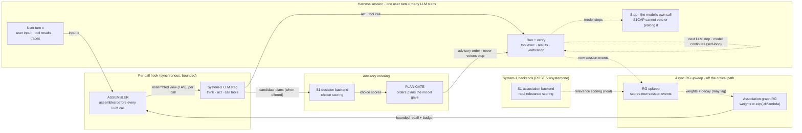

# S1CAP — Agent Implementation Brief

**Version** 0.1 · 2026-09-28 · Pre-implementation
**Purpose:** complete, self-contained instructions for an AI coding agent (DSH / Claude Code / opencode / pi) to build this project's software stack: the System-1-governed context-lifecycle middleware, the DSH plugin, the 2×2 benchmark/ablation harness, and the paper's experimental artifacts.

**Project one-liner:** a cheap System-1 *decision model* (Jev / Laya / Kev class, `/v1/systemone` protocol) acts as the **governance layer** over a System-2 LLM agent's context lifecycle — maintaining an association graph over session segments, assembling per-turn context with Trace-as-State ordering, and pre-ranking candidate plans — measured end-to-end on solve rate, token cost (cache hit/miss), and wall time.

---

## 0. Ground rules for the implementing agent

1. Everything in §1 was verified against live URLs on **2026-09-27/28** (three verification passes: paper/API/docs, related work, benchmarks/pricing). Do not re-verify; do not contradict. If a live API behaves differently from §1, **stop and report** — do not silently adapt.
2. Items marked `[VERIFY]` are deliberately unverified: verifying them is the first task of the milestone that names them.
3. Never invent benchmark numbers, API fields, or library names. If you need one not present here, ask the human.
4. The human owns the research decisions listed in §12. All other implementation decisions within this spec are yours.
5. Telemetry schemas (§8) are **versioned contracts**: after the first benchmark run starts, changing a field name breaks comparability — add fields, never rename.
6. **Control-plane isolation is a hard architectural rule** (docs/CONTROL_PLANE_LOGGING.md): System-1 calls, their telemetry and the backend's server logs go to a log stream that is *independent of the session event log*. No control-plane record may become a segment, enter the association graph, or appear in any LLM context or System-1 `state` — otherwise System-1 would end up scoring its own output and call count would compound per turn. Enforced in `packages/core/src/provenance.ts` (type families + runtime guards); do not relax it for convenience.
7. **The agent loop is model-owned and S1CAP is only a hook** (docs/ARCHITECTURE.md §6). One user turn is *many* LLM steps (think → act → tool → …), so the flow is a loop, not a chain: S1CAP assembles context before **every** LLM call under a hard deadline (on expiry the call proceeds unmodified), and maintains the association graph **asynchronously, off the critical path** (the graph may lag the session). Nothing in S1CAP may keep the loop alive: the harness stops when the model stops, the plan gate only reorders the plans the model already produced, and any S1CAP failure or timeout degrades to passthrough. `termination: 'model-owned'` and `rgMaintenance.mode: 'async'` are literal types in `AssemblyPolicy` — not toggles.
8. **The route diagram is authoritative and hand-authored** (`docs/figures/s1cap-technical-route.html`; text form `docs/figures/s1cap-technical-route.mmd`). It shows the loop-with-a-hook topology of rule 7. Never replace it with an auto-generated chain/pipeline figure, and keep every Mermaid copy (README, ARCHITECTURE, §2 here) in sync with it — a serial picture of this design is *wrong*, not merely stylised. An auto-laid-out serial version was produced earlier in this project and has been deleted for exactly that reason.
9. **Exactly one System-1 backend is active at a time.** `s1.provider` selects it (`jev | laya-serve | edgejev | kev | none`); enabling the local Laya runtime while selecting a cloud provider is a *configuration error*, never a silent priority decision — a session that quietly switches governors makes its own measurements meaningless. Enforced by `singleBackendIssues()` in `packages/s1-client/src/resolve.ts`; on conflict the plugin logs the conflict and runs the session with `provider=none` (observation only).
10. **Config is validated fail-safe, and credentials never reach a log or the transcript.** `validatePolicy()` (packages/core/src/config.ts), `validateLayaConfig()` (packages/laya-runtime/src/config.ts) and the plugin's telemetry check report every problem as a warning and keep the default — a typo in a profile patch must never break a live session. The API key comes from `s1.apiKey` or the provider's environment variable (`TYPESAFE_API_KEY`, generic fallback `S1CAP_API_KEY`), is passed straight to the client, and is only ever printed through `redactKey()`; session and control JSONL sinks must differ, because merging them would let control-plane records become segments (rule 6).

---

## 1. Verified facts base

### 1.1 Paper T — Trace as State (arXiv:2609.02702)

- Exists. Xu Zou (Z.ai), Jie Tang (Tsinghua), submitted 2026-09-02, cs.CL, CC BY 4.0. <https://arxiv.org/abs/2609.02702>
- **Method (no training — inference-time pass restructuring only):** run the model on the long-context problem, serialize its reasoning traces into a textual state proxy `T = π(r_1..r_ntr)` (fixed serializer, delimiters, truncated to the first 50,000 chars), then issue a **fresh pass** with the order `[T, x, q]` — trace **before** the long context `x`, question `q` **last** — versus the matched control `[x, T, q]`.
- **Results:** `[T,x,q]` beats `[x,T,q]` in 26 of 27 model×task×metric combos. GraphWalks Parents exact match: DeepSeek V4 Pro Preview 29.2% (single pass) → 43.0% (append) → **81.8%** (as-state); GLM-5.2 66.4/83.2 → **100.0%**. Models: DeepSeek V4 Pro Preview, GLM-5.2, Qwen 3.7 Max; datasets: GraphWalks 256K, MRCRv2 8-needle, NUB-1M.
- **Theory:** conditional state update tasks — condition-first needs `b` bits of working memory, condition-last can need `b·2^b` (exponential separation) for causal processors.
- **Practical caveat we must respect:** the paper places the **question last** in both conditions because "models may not behave as intended unless the question appears at the end".
- **Transplant principle for us:** task-state information discovered late (in reasoning traces) should be available **before** the history on the next pass; the current instruction stays **last**.

### 1.2 Jev — cloud System-1 decision model (TypeSafe AI)

- Endpoint: `POST https://api.typesafe.ai/v1/systemone`, `Authorization: Bearer <key>`; `GET /v1/models`. SDKs: Python `typesafe_sdk`, JS `@typesafe-ai/sdk`. Docs: <https://docs.typesafe.ai/api>
- Request: `{ state: string|object|array, model, questions: {<id>: {type, instructions, criteria}} }`. Response: `{ model, answers: {<id>: Answer}, usage: {input_tokens, output_tokens} }`.
- Question types:
  - `noul` (Bernoulli yes/no) → `{noul: 0..1}` (P(true); no confidence field)
  - `choice` (max **255** options) → `{choice, probabilities, confidence}`
  - `score` (2–10 ordered levels) → `{score, legend, probabilities, confidence}` (score can land between levels)
- Pricing (verified on site): **$0.042 per 1M input tokens, output free**. Limits: 250k tok/s, 1200 req/min, 64k tokens per request (state + all questions), 32k for state + longest question. Model `jev-1.13.0` (aliases `jev-latest`, `jev-preview`). <https://docs.typesafe.ai/models>
- **Parallel questions:** state ingested once, all questions evaluated in parallel — 13 questions in one call measured **12.2× cheaper, 10.0× faster** than separate calls, no answer change. <https://docs.typesafe.ai/cookbooks/parallel_questions>
- Documented weaknesses (jaggedness, jev-1.13, reviewed 2026-09-17) <https://docs.typesafe.ai/model-jaggedness/jev-1.13>: literal reading; unreliable math/counting/dates; indirection; **context rot on large irrelevant state**; adversarial content can steer answers (segments are untrusted input — see §5.5); contradictory instructions confuse; **structural invariants not guaranteed (probabilities may not sum to 1 — normalize server-side)**; no text generation; English best, CJK weaker.

### 1.3 Laya — open-source System-1 (Convai Innovations)

- Canonical repo <https://github.com/NandhaKishorM/laya>, HF `convaiinnovations/laya`, **Apache-2.0**, released 2026-09-18. Variants: `laya` 421M (ModernBERT-large, 512-ctx, English); `laya-multilingual` 322M (mmBERT-base, 1024-ctx, 100+ langs); `laya-typed-decisions` 421M (1024-ctx).
- Serving: `pip install "laya[serve]"` → `POST /v1/systemone`, **Jev wire-compatible** (TypeSafe clients work by changing `baseUrl`). Env: `LAYA_DEVICE`, `LAYA_THREADS`, `LAYA_MODELS`, `LAYA_API_KEY`. Free hosted endpoint: impossibl.com.
- **Honest limits (README):** base checkpoints are **near-chance zero-shot on typed decisions** (0.362 vs 0.318 random, 0.461 majority; 0.766 after fine-tuning; ECE 0.466 → 0.081 after temperature refit). Choices with **>20 options fail at default `head_max_len`**. Known bugs: noul label-following (#156), multilingual score position bias (#131), English checkpoint collapses on non-Latin scripts.
- **Design consequence:** never use zero-shot local Laya as the relevance scorer. Either (a) cloud Jev (cost ≈ negligible, §7.4), or (b) fine-tune `laya-typed-decisions` on our relevance/plan-rank tasks (M3) and serve locally.
- JevBench (MIT harness, 534 public + 308 sealed decisions, 4 axes Intelligence/Calibration/Speed/Cost; <https://www.benchmarkheaven.com/jev-models>): Jev 1.13.0 **#4** (63.3, $0.040/1k decisions, 0.65 s p50, 86.6% public / 36.7% sealed); Laya #43; kev-4B #30.

### 1.4 Local S1 runtimes (weak-CPU path)

- **EdgeJev** <https://github.com/yzfly/edgejev> (Apache-2.0): converts Laya/Kev to ONNX **INT8**, no torch at runtime, fully offline, serves `/v1/systemone`. Laya mmBERT-base 322M INT8 = **324 MB, 15.6 ms/decision on 4 vCPU** Xeon (AVX512-VNNI); INT8 costs ~3–4 accuracy points. Platforms: Linux/Windows x86 (AVX2/AVX512), macOS (CoreML), Linux ARM (SDOT). `[VERIFY]` behavior on pre-AVX2 CPUs at M0; cloud Jev is the documented fallback.
- **laya-mlx** <https://github.com/mizorewww/laya-mlx> (Apple Silicon): 13.42 ms P50 (421M), peak 943.6 MiB.
- **No llama.cpp/Ollama/vLLM serving for Laya/Kev** (encoder/pointer-head architectures, not GGUF).
- **Kev** <https://github.com/jaredpalmer/kev> (Apache-2.0): Qwen3.5-Base 0.8B/4B/9B + Qwen3.8 27B, LoRA + pointer head, `kev.serve` speaks `/v1/systemone`, CUDA/ROCm/MLX, Modal one-command deploy. 27B new-sources accuracy 0.848 vs Jev 0.857 (dev).

### 1.5 DSH plugin architecture (verified from local install + community plugin analysis)

- DSH = DeepSeek Harness, open source (<https://github.com/deepseek-ai/deepseek-harness>), Electron app + agent runtime. Profiles live at `~/.dsh/profiles/<name>/` with `package.json` (field `dsh.profile.bundles`) and `cordis.patch.yml` (loader patch entries: `id` / `name` / `config`); `patchReload: live` enables hot reload.
- **Plugin = npm package** declaring `dsh.bundle.patch: "./cordis.patch.yml"` (+ optional `dsh.client` for web-UI injection, `dsh.compatibility.dshReleases`). Install: `dsh plugin --profile web add <pkg|file:path>` — auto-registers in bundles and composes insert lines.
- Official peer contracts (from `dsh-command-context-trim@0.3.2`, npm registry): `@deepseek-ai/cordis ^4.0.2`, `@deepseek-ai/dsh-llm`, `dsh-session`, `dsh-commands`, `dsh-compaction`, `dsh-invariants`, `dsh-token-meter`, `@deepseek-ai/schemastery` (0.1.2-rc.1 line; compatibility declared for 0.1.2-rc.1 / 0.1.5-rc.2 / 0.1.5-rc.3 / 0.1.7-rc.2).
- **Session model — the load-bearing fact:** a persistent **append-only event log** (the human record, never rewritten) is separate from the **surface** (the model view). Model-only rewrites happen via `surfaceOp {op:'replace', startSeq, endSeq}` on `user/message` events (0.1.2 shape used `start`/`end`; probe which shape the host accepts — context-trim does a one-shot probe). `system/message` is node 0 (0.1.5+) and a **barrier**: never trimmed, never crossed. **The transcript shown to the user stays strictly chronological — this natively satisfies the project's "user sees chronology, model sees assembled context" requirement.**
- Hook points: `agent/pre-step` (before each LLM call — where compaction registers its pressure path), `agent/request-error` (Cordis **waterfall**; `{prepend: true}` unshifts ahead of compaction's recovery), `agent.runMaintenance()` (idle-time ops), `ctx.tokenMeter` (shadow-price token accounting, O(1) projection), `compaction/prune` + `toolResultPruner` (tool-result slimming with `toolPairingBalancedBefore/After`), `model/selection` intent.
- Overflow flow today: request fails `CONTEXT_WINDOW_EXCEEDED` → (prepend) model-free trim / in-place slim → retry → else compaction (prune + LLM summarize).
- Dev/verify commands: `dsh --dump-config`, isolated installs via `DSH_HOME`, `npm run link:harness` pattern, `node --test` suites, session-log replay tests ("replay rewritten log → identical token totals").

### 1.6 Harness portability facts

- **opencode:** `provider.<id>.options.baseURL` override; custom OpenAI-compatible providers via `@ai-sdk/openai-compatible`; plugin system. <https://opencode.ai/docs/providers/>
- **Claude Code:** `ANTHROPIC_BASE_URL` gateway/proxy is an established community pattern; hooks + plugins exist. `[VERIFY]` current hook event names at M4.
- **pi** (badlogic `pi-mono`, `@earendil-works/pi-coding-agent`): **pi-system-one** (npm, MIT) registers a `system_one` **tool** the agent may call — *System One as a tool (agent-in-the-loop)*. Our layer is orthogonal: *System One as governance (infrastructure-in-the-loop; the agent never calls it — it shapes what the agent sees)*. Cite as related work, not a competitor. Also reuse `system-one-core` (npm) as `/v1/systemone` client if its surface fits. `[VERIFY]` at M1.
- **DSH custom provider:** `@deepseek-ai/dsh-llm-pi-ai` bundle with `providers` config (`id/name/contextWindow/maxTokens/input/apiKeyEnv`). `[VERIFY]` its `baseUrl` config key at M0 (read the bundle's schemastery schema in the local install).
- Anthropic-format endpoint on DeepSeek: `https://api.deepseek.com/anthropic` (per DeepSeek docs) — lets Claude-Code-style harnesses talk to DeepSeek directly.

### 1.7 Pricing anchors (fetched 2026-09-27/28; all per 1M tokens)

| Provider / model | input cache-hit | input cache-miss | output | notes |
|---|---|---|---|---|
| DeepSeek `deepseek-flash` (V4.1-Flash) | $0.006 ($0.003 off-peak) | $0.30 ($0.15) | $1.20 ($0.60) | 1M ctx / 384K max out; peak = 01:00–04:00 & 06:00–10:00 UTC weekdays |
| DeepSeek `deepseek-v4-pro` | $0.044 ($0.022) | $1.32 ($0.66) | $3.96 ($1.98) | 1M ctx |
| GLM-5.3 | $0.26 | $1.40 | $4.40 | docs.z.ai |
| GLM-5.3-Flash | $0.03 | $0.15 | $0.50 | docs.z.ai |
| Jev (cloud) | — $0.042 input-only, output free — | | | docs.typesafe.ai/models |
| Anthropic (reference) | 0.1× base (read) | 1.25× base (5-min write) | — | 1,024-token minimum prefix |
| OpenAI (reference, mirror-sourced) | 10% of input | GPT-5.6+ write 1.25× | — | automatic after 1,024-token repeat |

Sources: <https://api-docs.deepseek.com/quick_start/pricing>, <https://docs.z.ai/guides/overview/pricing>, <https://docs.typesafe.ai/models>, <https://code.claude.com/docs/en/prompt-caching.md>.

**The user's model ID is corrected:** there is no `deepseek-v4.1-flash` API id — the id is **`deepseek-flash`**, which serves model version DeepSeek-V4.1-Flash (legacy `deepseek-v4-flash` alias still accepted). `deepseek-chat`/`deepseek-reasoner` no longer appear in the docs.

**Economic headline:** DeepSeek cache-hit tokens are **~50× cheaper** than cache-miss at peak. Cache-hit rate is the single biggest cost lever in the entire ablation — and reordering context (Trace-as-State) has a *measurable cache penalty* that our telemetry must isolate as a first-class hypothesis (**H3**, §9.3).

---

## 2. System overview

Two planes:


- **Event intake:** the harness adapter turns session events (user input x, tool results, reasoning traces) into `RawEvent`s and writes the assembled context back to the **model view only** (§5.1, §6).
- **Segment / Recall:** message-level segments (never token-level, per the project's segmentation rule) + two-tier candidate generation — tier-0 metadata (free, always on) and tier-1 (embedding ANN *or* S1 noul batch, config-selected).
- **S1 association backend:** scores each new segment against history segments (batched `noul` questions, ≤ 20 per call) and returns the weights that expand the RG.
- **Association graph (RG):** nodes = segments; edges = verified relevance weights with `w·exp(−Δt/λ)` recency decay; in-memory index at M0 (SQLite persistence lands with M1).
- **ASSEMBLER:** bounded-BFS selection under the token budget + Trace-as-State layout + cache-aware prefix policy; rewrites the *model view* only (DSH `surfaceOp`; proxy message rewrite elsewhere).
- **System-2 LLM:** the governed host model; consumes the assembled context and emits reasoning, candidate plans and tool calls.
- **S1 decision backend:** scores the LLM's candidate plans in one `choice` call and returns probabilities + confidence.
- **PLAN GATE:** consumes those scores — normalization, abstention, attempt cap `M=2`, execution ordering — and does **not** call System-1 itself.
- **Run + verify:** executes plans in the gate's order against the benchmark-native verification oracle; drops the remaining plans on first success.
- **TELEMETRY:** per-call JSONL (LLM/S1/tool), aggregates, cost model (§8).
- **ADAPTERS:** DSH plugin (first-class) + OpenAI-compatible proxy (portable to opencode / Claude Code / pi).

---

## 3. Repository layout

pnpm monorepo:

```
s1cap/
  packages/core/        # segmenter, rg, assembler, plan-gate, config, telemetry schemas (pure TS, no IO)
  packages/s1-client/   # /v1/systemone client + provider matrix (jev | laya-serve | edgejev | kev | none)
  packages/proxy/       # OpenAI-compatible middleware (Hono): passthrough + request rewrite + telemetry
  packages/dsh-plugin/  # "dsh-s1cap": cordis bundle, surface assembly, pre-step hook, /s1 commands
  bench/
    runners/            # swe-verified/ | terminal-bench/ | tau2/  (fetch, run cell, parse, score)
    cells/              # the four ablation cell configs (JSON)
    stats/              # McNemar, paired bootstrap, effect sizes, Holm; frozen analysis script
    analysis/           # figure generation (Pareto, cache waterfall, case studies)
  docs/                 # PROPOSAL.md, ARCHITECTURE.md, AGENT_BRIEF.md, FORMULAS.md, RELATED_WORK.md, REPO_METADATA.md
  paper/                # LaTeX outline per §11
```

---

## 4. Core interfaces (TypeScript sketches — finalize, don't redesign without reason)

```ts
type SegmentKind = 'user' | 'assistant' | 'trace' | 'toolCall' | 'toolResult' | 'system-pinned';

interface Segment {
  id: string; sessionId: string; seq: number;          // seq = position in append-only log
  kind: SegmentKind; role?: string;
  tokens: number;                                        // tokenMeter estimate
  text: string; ts: number; taskTag?: string;            // taskTag from task lifecycle events
  chunkOf?: string;                                       // for chunked tool results
}

interface AssociationEdge {
  from: string; to: string;
  w: number;                                              // tier-2 verified weight ∈ [0,1]
  wTier1: number;                                         // pre-verification candidate weight
  source: 'meta' | 'embed' | 's1-noul' | 's1-score';
  verifiedAt: number; provenance: string;                 // question id + answer for /s1 why
}

interface AssemblyPolicy {
  cell: 'C1' | 'C2' | 'C3' | 'C4';
  tas: { on: boolean; tMaxChars: number; updatePolicy: 'perTask' | 'perTurn' };
  recall: { tau: number; depth: number; fanout: number; tier1: 'embed' | 's1' | 'off';
            embedModel?: string; budgetRatio: number; minRecalledShare: number };
  tail: { k: number };                                    // verbatim recent turns always kept
  planGate: { on: boolean; maxPlans: number; attemptCap: number; abstainConfidence: number };
  s1: { provider: 'jev' | 'laya-serve' | 'edgejev' | 'kev' | 'none';
        baseUrl?: string; model?: string; timeoutMs: number; questionsPerCall: number };
}

interface S1Client {                                      // thin wrapper over /v1/systemone
  decide(req: { state: unknown; questions: Record<string, S1Question> }):
    Promise<{ answers: Record<string, S1Answer>; usage: { inputTokens: number; outputTokens: number }; ms: number }>;
}
type S1Question =
  | { type: 'noul'; instructions: string; criteria?: { true: string; false: string } }
  | { type: 'choice'; instructions: string; criteria: Record<string, string | null> }
  | { type: 'score'; instructions: string; criteria: string[] };

interface AssemblyResult {
  layout: { pinned: string; stateProxy?: string; recalled: Segment[]; tail: Segment[]; anchor: string };
  budget: { total: number; used: number; byBlock: Record<string, number> };
  fallback?: 'recency-window';                            // degradation event
  cacheStability: { prefixTokensStable: number };         // for H3 accounting
}
```

All knobs map 1:1 to plugin config (`cordis.patch.yml` → `/s1 config` UI): `recall.tau` (τ), `recall.depth` (d), fanout, tail K, T max chars, attempt cap, S1 provider.

---

## 5. Algorithms

### 5.1 Segmentation policy

- `user/message` → 1 segment (chunk >512 tokens with 64-token overlap).
- `assistant/message` → 1 segment; its reasoning trace (provider `reasoning_content`, when exposed `[VERIFY]` field name for deepseek-flash / GLM at M0) → separate `trace` segments.
- `tool/result` → chunk to ≤512-token segments (keep head + tail; store chunk map for reconstitution).
- `system/message` node 0 + tool schemas → **PINNED**, excluded from the graph.
- Segment granularity is message-level — never token-level (the project's segmentation rule).

### 5.2 Association-graph construction (per new segment p) — S1 association backend

- **Tier 0 (metadata, free):** edges to segments sharing `taskTag`, same tool family, reply-to chain; fixed weight 0.6.
- **Tier 1 (candidates):** mode `embed` — local embedding + ANN top-k (k=32) cosine; or mode `s1` — one `/v1/systemone` call: `state = p` (≤512 tok), `questions = {"rel_<i>": noul "Does this segment discuss the same task, entity, or topic as the state?"}` over candidate ids, ≤20 questions per call (**context-rot guard**), normalized server-side.
- **Tier 2 (verification, lazy — only for edges that could enter assembly):** `score` question per edge → `w ∈ [0,1]`; abstain (confidence < 0.5) → keep tier-1 weight × 0.8.
- **Decay:** `w_eff = w · exp(−Δt/λ)`, λ default 30 min of active session time (tunable).
- **Persistence:** SQLite (`segments`, `edges`, weights, verification provenance).
- Complexity: tier-1 embed is O(log n) ANN per segment; tier-2 batches into ONE parallel-question call (§1.2). Total per turn stays in the tens of ms locally, sub-cent in cost.

### 5.3 Context assembly (per LLM call) — the Trace-as-State transplant

- Budget `B = contextWindow − reserveOutput − fixedOverhead` (token meter).
- **Seed set:** current user input `x` + pinned + last K turns verbatim (K=3 default).
- **BFS** from `x` over edges with `w_eff > τ` (default 0.55), depth ≤ d (default 2), per-node expansion top-`fanout` (8); greedy knapsack by `w_eff` until the recalled-block budget (`budgetRatio` of B, default 0.35) is filled; every block wrapped with a provenance header (`«memory #seq · role · tool · HH:MM»`).
- Dedup against the verbatim tail (by segment id).
- **Layout (factor TAS on):**

```
[pinned: system prompt + tool schemas]        ← immutable, cache-stable prefix
[T: task-state proxy]                          ≤ tMaxChars (default 8k): serialized recent
                                               reasoning traces + task brief; append-only;
                                               updatePolicy perTask (cache-friendly) | perTurn
[recalled blocks: w_eff desc, then recency]    strongest first (Lost-in-the-Middle U-shape: strong
                                               start, strong tail)
[verbatim tail: last K turns]
[x + current state snapshot + instruction]     ← ALWAYS LAST (paper T: question-last required)
```

- Factor TAS off (cells C1/C3): `[pinned | (selected or full) history chronological | x]`, no T block.
- **Fallback:** if recalled mass < `minRecalledShare` (25%), degrade to chronological last-N window; log event.
- **Cache-awareness:** the pinned prefix is never reordered; T grows append-only; `updatePolicy: perTask` keeps T byte-stable within a task so the cache invalidation of `[T | recalled | tail | x]` happens at task boundaries, not per turn. The residual cache penalty is *measured*, not assumed (H3).
- **DSH realization:** model-only rewrite via `surfaceOp {op:'replace'}` — the user-facing transcript is never touched. Non-DSH: the proxy rewrites the messages array before forwarding.

### 5.4 Plan gate (factor S1G on) — S1 decision backend

- Trigger: assistant emits a tool-call batch; if `planGate.on` and >1 plausible plan exists (harness prompted — system addendum asks for ≤`maxPlans` (3) alternative plans as structured JSON when ambiguity is high; default elicitation `on-demand`).
- **Dataflow (topology frozen 2026-09-28):** the LLM's candidate plans go **directly to the S1 decision backend** for the choice scoring; the PLAN GATE consumes the returned probabilities + confidence and applies normalization, abstention, ordering and the attempt cap, then hands the ordered plan to execution. The gate does not make the System-1 call itself.
- **One choice question per plan set:** `state = {task brief, x, T}`; options = plan summaries (≤8; Jev handles 255 natively, Laya caps ~20 at defaults — the cap protects the local path); `criteria` = "Which plan is most likely to complete the task correctly with the least wasted work?"
- **Normalize probabilities server-side** (Jev invariants not guaranteed, §1.2).
- **Attempt controller:** execute in probability order; verification oracle = harness-native (tests / build / exit criteria per benchmark); attempt cap **M=2** (candidate plans m ≤ 3); on success, discard remaining plans and log saved-token estimate; abstain (confidence < 0.5) → keep the LLM's own order.
- Always log per-plan `{prob, confidence, executed, verified, tokensSpent}`.

### 5.5 Degradation & safety

- S1 timeout (800 ms local / 2500 ms cloud) → skip tier-2 that turn; plan gate passes through.
- S1 hard-down → tier-0 metadata + recency only; log mode per call (never fail the session).
- **Adversarial-content guard (Jev is steerable, §1.2):** segments passed as S1 `state` are pre-filtered — strip code blocks/URLs >N tokens, keep role + first 256 tokens + tool name. The S1 never sees raw untrusted tool output in full.
- Never drop: pinned, `x`, verbatim tail K, and the **tool-call/result pairing invariant** (reuse `toolPairingBalancedBefore/After` from `@deepseek-ai/dsh-compaction` in the DSH path; reimplement in the proxy path).

---

## 6. DSH plugin (`dsh-s1cap`)

- `package.json`: name `dsh-s1cap`; `dsh.bundle.patch`; peerDeps mirror `dsh-command-context-trim` (§1.5); dev-pin harness contracts as devDependencies; `dsh.compatibility.dshReleases` for 0.1.2-rc.1 / 0.1.5-rc.x / 0.1.7-rc.2.
- `cordis.patch.yml` insert: `id: s1cap`, config surface = §4 `AssemblyPolicy` defaults.
- Registrations:
  - message-append events → SEGMENTER + tier-1 RECALL incrementally (background, awaitable);
  - `agent/pre-step` listener → ASSEMBLER → surface replace ops (non-S1 path < 50 ms);
  - token-meter integration → budget + fixed overhead; own usage events from response `usage`;
  - plan gate → assistant tool-call batch hook (ordering-only intervention, never alters semantics).
- Commands: `/s1 status`, `/s1 config`, `/s1 graph` (RG stats), `/s1 why <seq>` (provenance: which question/answer pulled a segment in — doubles as paper case-study material).
- Settings UI (`dsh.client` inject): the four cell presets (C1–C4), τ/d/fanout/K sliders, S1 provider picker (cloud Jev | local EdgeJev | laya-serve | none), telemetry export.
- Tests: `DSH_HOME` isolated profile; `dsh --dump-config` assertion; `node --test` units for SEGMENTER/RG/ASSEMBLER on synthetic sessions; **replay correctness** — rewrite a persisted session log, replay, totals must match tokenMeter exactly (the context-trim test pattern).

---

## 7. S1 backend layer (`packages/s1-client`)

- Wire: `POST {baseUrl}/v1/systemone` (§1.2 shape), `GET /v1/models`; env `SYSTEM_ONE_BASE_URL` / `SYSTEM_ONE_MODEL` / `SYSTEM_ONE_API_KEY` (de-facto standard from pi-system-one).
- Providers: `jev` (api.typesafe.ai), `laya-serve`, `edgejev`, `kev` (local), `none`. Evaluate reusing `system-one-core` (npm) `[VERIFY]` at M1; else vendor a minimal client (it is ~100 lines).
- Features: noul fan-out batching, probability normalization, timeout/circuit breaker, cost accounting from `usage`, per-provider calibration notes (Laya temperature refit at M3 if local path chosen).
- Local distribution: EdgeJev INT8 ONNX artifacts (324 MB) via **download-on-demand installer script** (not bundled in the npm tarball); document AVX2 requirement; cloud Jev is the fallback for CPUs without AVX2.

### 7.4 Cost sanity (cloud-Jev path, arithmetic from §1.2/§1.7 — check at M0)

One new segment, 100 candidates, ~150 tokens each ≈ 15k input tokens per assembly turn ≈ **$0.0006**; a 60-segment session ≈ **$0.04** of Jev spend — versus one LLM call at 30k miss-priced input ($0.009 at peak) per turn. S1 spend is noise-level; the *LLM* savings (fewer miss tokens, fewer wasted plan attempts) are where the economics live.

---

## 8. Telemetry & cost accounting

### 8.1 Event schema (JSONL, schema `v1`)

```
llm_call    { ts, sessionId, taskId?, cell, model, seq, promptTokens, cacheHitTokens,
              cacheMissTokens, outputTokens, reasoningTokens?, tReqOut, tFirstTok?, tEnd,
              netLatencyMs, approvalWaitMs, s1Assist: {calls, tokens, ms},
              flags: { tas, sel, planGate, degraded } }
s1_call     { ts, provider, role: assoc|decide, kind: noul|choice|score, questions,
              inputTokens, outputTokens, ms, turnId?, scoredSegmentIds?, routedModel? }
tool_call   { ts, tool, ms, ok, approvalWaitMs }
assembly    { ts, seq, candidates, selected, bfsDepth, budgetUsed, blocks: {pinned,T,recalled,tail,x},
              cacheStability: {prefixTokensStable}, fallback? }
plan_gate   { ts, plans[], probs[], confidence[], order, executed, verified, savedTokensEst }
```

**Two sinks, never one.** The records above are the **control-plane log** (`control.jsonl`); the
harness's own events — the only source of segments — are the **session log** (`session.jsonl`).
The control log is never segmented, never indexed in the RG and never placed in a System-1 `state`
(§0.6, docs/CONTROL_PLANE_LOGGING.md).

### 8.2 Approval-wait exclusion (user requirement)

Benchmark runs use an auto-approve sandbox (allowlisted tools, unattended), so approval waits ≈ 0 by design; for interactive runs, subtract the harness's permission-prompt gaps (recorded on tool_call events) from `netLatencyMs`. `netLatencyMs = tEnd − tReqOut − backoff − approvalWaitMs` (network RTT is included unless a per-provider RTT probe is configured; document which convention each figure uses — never mix).

### 8.3 Cost model

`cost_task = Σ(c_hit·hit + c_miss·miss + c_out·out) + Σ(s1 cost) + 0 (local runtime amortization = 0 for cloud)`.
Report **cache-hit rate before/after each assembly change** per call — the TAS-reordering cache penalty is hypothesis **H3**, a first-class measured quantity, not a footnote.

---

## 9. Benchmark & experiment protocol

### 9.1 Design — 2×2 within-task paired factorial

| Cell | TAS ordering (factor A) | S1 governance (factor B: selection + plan gate) |
|---|---|---|
| C1 baseline | off (chronological) | off (native compaction only) |
| C2 | **on** (`[pinned|T|history|x]`) | off |
| C3 | off (chronological, selected blocks) | **on** |
| C4 full | **on** | **on** |

Same tasks, same model, temperature 0 (main), same harness version, same tool allowlist, randomized run order. Paired n per cell per benchmark: SWE-bench Verified 100 (stratified subset of the 500), Terminal-Bench 4.0 all 66, tau2-bench full `base` split (`[VERIFY]` exact count at M0; ~280 expected).

### 9.2 Benchmarks (verified)

- **SWE-bench Verified** — 500 human-validated tasks, MIT, automated FAIL_TO_PASS/PASS_TO_PASS scoring, per-instance docker, no network needed. <https://www.swebench.com/verified.html>
- **Terminal-Bench 4.0** — 66 tasks (Aug 2026; 2.0 was Nov 2025), Apache-2.0, per-task test suites, Harbor framework (`harbor run -d terminal-bench/terminal-bench@4.0.0`), docker, 8 h timeout. <https://www.tbench.ai>
- **tau2-bench** (τ²) — MIT, automated reward from DB end-state, LLM user-simulator via LiteLLM (works with DeepSeek), pure Python no docker; adds the multi-turn tool-use + user-interaction axis. <https://github.com/sierra-research/tau2-bench>
- Excluded, with reasons: GAIA (browsing + multimodal noise for a terminal ablation), TheAgentCompany (30+ GB infra + LLM-judge confound), Aider polyglot (edit-format confound — but its leaderboard's per-run token stats are a calibration anchor: ~12k prompt + 3.5–11.7k completion tokens/exercise), LiveCodeBench (not agentic), OSWorld/WebArena (GUI-bound).

### 9.3 Metrics, hypotheses, success rule

- **Primary:** solve rate per benchmark. **Secondary:** $/task, tokens/task (hit/miss/out split), wall-clock/task (net LLM + S1 + tools), cache-hit rate, S1 calls & ms, tool errors, overflow/compaction events.
- **H1** (selection): C3/C4 use fewer context tokens at non-inferior solve rate. **H2** (plan gate): C4 spends fewer wasted-attempt tokens. **H3** (cache penalty, cuts both ways): TAS layout changes hit-rate; net cost effect measured per `updatePolicy`. **H4** (transfer): C1→C4 deltas persist on a second harness (opencode) at 10% subsample.
- **Success rule (replaces "win any of three"):** solve-rate **non-inferiority** vs C1 (paired McNemar, one-sided α=0.05, margin −2 pp absolute) **AND** ≥10% improvement in cost/task **OR** time/task with 95% CI excluding 0 (paired bootstrap, 10k resamples; Holm correction across the secondary family). A cell that wins cost but loses >2 pp solve rate is **not** a win. Report all cells + a quality-vs-cost Pareto figure.
- `[VERIFY]` power analysis in `bench/stats` before the grid: with paired n=100 (SWE-V) McNemar at 80% power resolves ~14–15 pp differences; n=66 (TB) ~18 pp; report the minimal detectable effect honestly.

### 9.4 Validity controls

Pin model versions + log call dates; 3 seeds on a 10% subsample for variance; automated scorers only (no LLM judges); contamination caveats stated (SWE-bench Verified is known-contaminated-adjacent — cite Don't-Break-the-Cache-style measurement care and SWE-bench-Live as the contamination-free fallback for a 20-task spot-check); the analysis script is **frozen and committed before** the first full run (pre-registration).

### 9.5 Generality (kills the "DSH result engineering" suspicion)

Re-run C1 vs C4 on **one additional harness through the proxy** (opencode first; Claude Code/pi stretch) on the same benchmark subset (10%); repeat a 10% subsample with the model swapped (GLM-5.3) to show provider-agnosticism. Same core package, same telemetry schema, only the adapter differs.

### 9.6 Cost budget (deepseek-flash, peak; assumptions labeled)

Per grid (4 cells × ~1,780 episodes): SWE-V 100/cell ≈ $21; tau2 ≈ $22; Terminal-Bench ≈ $440 **lean assumption** (5M in + 1M out per task; frontier-scale TB runs 20–65M tokens/episode → budget-buster) — **pilot 10 TB tasks first** to pin tokens/task; Artificial Analysis publishes per-model TB 4.0 cost/task for calibration. Total ≈ **$480 peak / $240 off-peak** (off-peak = 50% discount outside 01:00–04:00 & 06:00–10:00 UTC weekdays — schedule runs accordingly). Optional `deepseek-v4-pro` arm on SWE-V only: +$76. GLM-5.3 10% model-swap check: budget +$40.

---

## 10. Milestones

| M | Week | Deliverable | Acceptance |
|---|---|---|---|
| M0 | 1 | All `[VERIFY]` items closed; monorepo scaffold; `s1-client` against live Jev + laya-serve; telemetry v1; DSH plugin skeleton | `dsh --dump-config` shows the bundle; hardcoded assembly rewrites surface in a smoke session |
| M1 | 2–3 | SEGMENTER + RG + ASSEMBLER; proxy MVP; replay-correctness tests | ≥90% core coverage; replay invariance green |
| M2 | 3–4 | Plan gate; degradation paths; settings UI; **TB 10-task pilot** (pins the cost model); GAIA-free runner set up | Pilot report; C1 vs C4 smoke on 10 SWE-V tasks |
| M3 | 5–6 | Full 2×2 on SWE-V + tau2 (+TB if pilot green); optional Laya fine-tune + calibration refit | 4 cells × n complete; frozen stats module emits the report |
| M4 | 7–8 | Terminal-Bench cells; opencode transfer check (10%); GLM model-swap check (10%) | H4 evaluated |
| M5 | 9–10 | Paper artifacts: Pareto + cache-waterfall figures, case studies (`/s1 why` traces), LaTeX draft per §11 | Full draft |

---

## 11. Paper outline (Technique paper)

- **Title (LOCKED, user decision 2026-09-28):** *S1CAP: Selective Context and Adaptive Planning via System-1 Models for Efficient LLM Agents*
  - In-paper expansion: "S1CAP (System-1 Selective Context and Adaptive Planning)".
  - Collision check 2026-09-28: no AI/ML/agent-space collision for "S1CAP" (web-search hits are biomedical false positives — "severe community-acquired pneumonia" literature). npm `s1cap` and `dsh-s1cap` both unregistered (404) — reserved for this project.
  - Accepted residual flag (user decision): "Selective Context" shares its name with Xiao et al., EMNLP 2023 token-level compression (github.com/liyucheng09/Selective_Context). Mitigation is mandatory in paper §2: cite it and explicitly distinguish — token-level pruning for input compression vs segment-level association-graph recall for agent context lifecycle.
  - Repo/package naming (decided 2026-09-28): repo `s1cap`, npm proxy `s1cap`, DSH plugin `dsh-s1cap` — paper, repo and plugin names aligned. Repository: github.com/Jaffe2718/s1cap
- 1 Intro: agent-loop context economics (cache-hit ≈ 50× cheaper than miss); Trace-as-State principle; the arrival of decision models.
- 2 Related work: agent memory (MemGPT, Mem0, Zep, A-Mem, HippoRAG 1/2, MemOS, MESA, GAAMA, EMem); in-loop folding (AgentFold); order sensitivity (Lost in the Middle, Re2, Ok&Lee, CoRe, Racing Thoughts); prompt compression (LLMLingua 1/2); caching (Prompt Cache, CacheGen, Don't Break the Cache); routing/cascades (RouteLLM, FrugalGPT, Hybrid LLM); harness prior art (dsh-command-context-trim, pi-system-one, hermes-jev-skills, dsh-typesafe, laya-jev-GraphRAG); decision models (Jev, Laya, Kev, JevBench). Full verified list: `docs/RELATED_WORK.md`.
- 3 Method: S1CAP control-layer architecture; association graph; TAS assembly; plan gate; cost model.
- 4 Setup: 2×2, benchmarks, telemetry.
- 5 Results: quality/cost/time + Pareto; **cache-hit waterfall (H3)**; degradation; case studies.
- 6 Analysis: when does TAS pay for its cache penalty; S1 decision quality vs outcome; failure modes (jaggedness, adversarial segments).
- 7 Discussion: limits, ethics (black-box gating, bias in decision models — cite Jev's own bias discussion), generality.
- **Contributions:** (1) first infrastructure-in-the-loop use of decision models for agent context lifecycle; (2) Trace-as-State transplanted from single-document QA into live agent loops with cache-aware accounting; (3) an open 2×2 benchmark suite + versioned telemetry schema; (4) a DSH plugin + portable proxy.

---

## 12. Open questions for the human (do NOT decide alone)

1. Primary model: `deepseek-flash` (recommended; cheap, 1M ctx, vision) vs GLM-5.3 — affects budget and cache fields.
2. Headline S1 backend for the paper: cloud Jev (quality, trivial integration) vs local fine-tuned Laya/EdgeJev (offline story, more work, M3 risk).
3. Hard budget cap for the full grid (recommended ≥ $500 to survive a frontier-scale TB surprise).
4. Target venue + deadline (scopes M5).
5. Publish the Laya fine-tune weights? (Apache-2.0 base permits.)

---

## 13. Source index (all fetched 2026-09-27/28)

Paper T: arxiv.org/abs/2609.02702 · Jev: docs.typesafe.ai/{api,models,model-jaggedness/jev-1.13,cookbooks/parallel_questions} · Laya: github.com/NandhaKishorM/laya · EdgeJev: github.com/yzfly/edgejev · Kev: github.com/jaredpalmer/kev · JevBench: benchmarkheaven.com/jev-models · DeepSeek: api-docs.deepseek.com/quick_start/pricing · GLM: docs.z.ai/guides/overview/pricing · DSH plugin mechanics: registry.npmjs.org/dsh-command-context-trim (README) + local `~/.dsh/profiles/desktop/` inspection · opencode: opencode.ai/docs/providers · pi-system-one: registry.npmjs.org/pi-system-one · Benchmarks: swebench.com/verified.html, tbench.ai, github.com/sierra-research/tau2-bench · Related work: see `docs/RELATED_WORK.md`.
