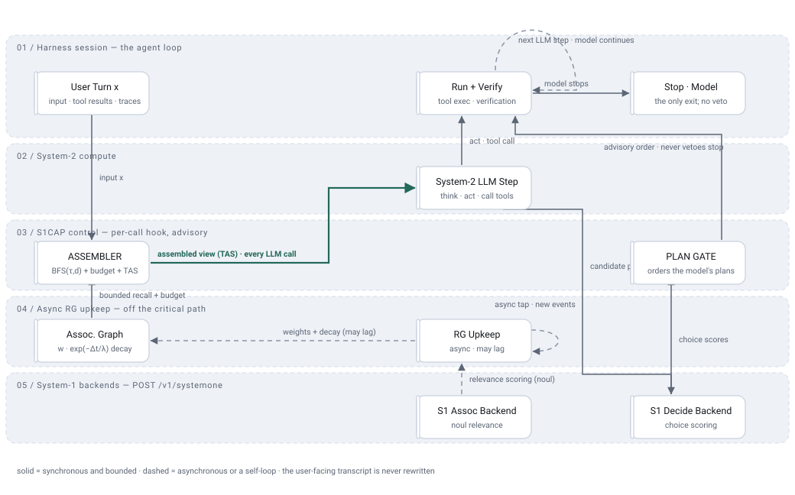

# S1CAP Architecture — Modules and Connections

Reference for the connections drawn in the route diagram
([`figures/s1cap-technical-route.html`](./figures/s1cap-technical-route.html) — hand-authored, and the single
geometry source). The committed SVGs
([`light`](./figures/s1cap-technical-route.light.svg) · [`dark`](./figures/s1cap-technical-route.dark.svg)) are
generated from it by `scripts/build-route-svg.mjs` and embedded in the README and in AGENT_BRIEF §2.

**Diagram maintenance — do not regress.** The flow is a loop with a hook: `Run + Verify` carries a self-loop
(`next LLM step · model continues`) and association-graph upkeep sits in its own asynchronous lane. Never
regenerate this figure with an automatic pipeline layout: an auto-laid-out serial chain misstates the design by
hiding both the inner loop and the async decoupling. `docs/figures/s1cap-technical-route.html` is the single
authoritative picture; the SVGs are generated from it and no second hand-drawn copy may be introduced.

Status legend: **✅ implemented** · **🟡 partially implemented** · **🔜 planned** · **◻ external**.
Milestone position: M0 complete; **M1 observation mode live and verified in real sessions** (per-call
SEGMENTER → RECALL → ASSEMBLER with the prompt untouched, the system prompt sourced so the pinned block and the
cache-stable prefix are non-zero, asynchronous upkeep fed by real `session/event` traffic, replay parity over a
recorded tape). Writing the assembled view back into the model context — and with it the settings panel that
holds the Jev key — is what remains. Evidence per item: [`STATUS.md`](./STATUS.md).

---

## 1. Diagram

Five layers, one row per layer, top to bottom. The picture above is the generated SVG; the arrow-level
topology — the inner loop's self-edge, the asynchronous tap and the advisory edge back into the loop — is in §2
below and in [`figures/s1cap-technical-route.html`](./figures/s1cap-technical-route.html).

<picture>
  <source media="(prefers-color-scheme: dark)" srcset="./figures/s1cap-technical-route.dark.svg">
  
</picture>

## 2. Connections (edge semantics)

| # | From → To | Payload | Mechanism |
|---|---|---|---|
| e1 | Event intake → Segment / Recall | new session event | every append to the session log is segmented (message level) |
| e2 | Segment / Recall → S1 association backend | new segment × history segments | tier-1 candidate generation: batched `noul` questions, ≤ 20 per call |
| e9 | S1 association backend → Association graph | edge weights + decay metadata | tier-2 verified edges are written into the RG |
| e3 | Association graph → ASSEMBLER | bounded recall set | `recall(seeds, {tau, depth, fanout})` then budget knapsack |
| e4 | ASSEMBLER → System-2 LLM | assembled prompt | Trace-as-State layout `[pinned \| T \| recalled \| tail \| x]`; model view only |
| e5 | System-2 LLM → S1 decision backend | candidate plans (m ≤ 3) | plans go **directly** to the decision backend for choice scoring |
| e10 | S1 decision backend → PLAN GATE | probabilities + confidence | gate consumes scores; it does not call System-1 itself |
| e7 | PLAN GATE → Run + verify | ordered plan list | attempt controller: probability order, cap **M = 2** |
| e8 | Run + verify → Event intake | tool results | results re-enter as new session events (turn loop) |

## 3. Modules

| Module | Responsibility | Inputs | Outputs | Key parameters | Degradation | Status · code |
|---|---|---|---|---|---|---|
| **Event intake** | Harness adapter: turn session events into `RawEvent`; write the assembled context back to the **model view only** (user transcript stays chronological) | harness event stream (append-only log) | `RawEvent` → Segment / Recall; surface rewrite ops | — | plugin load failure → native harness behaviour | 🟡 adapter + observation live (M1) · `packages/dsh-plugin/src/harness-adapter.ts`, `observer.ts`, `control-log.ts` · 🔜 model-view write-back, `packages/proxy` |
| **Segment / Recall** | Split each event into **message-level** segments (never token-level); generate relevance candidates | `RawEvent` | `Segment[]`, candidate edge list | `chunkTokens=512`, `overlapTokens=64`; tier-1 = `embed` (ANN top-k=32) or `s1`; `questionsPerCall ≤ 20` | tier-1 unavailable → tier-0 metadata only | ✅ segmenter · `packages/core/src/segmenter.ts`; 🔜 tier-1 orchestration |
| **S1 association backend** | Score relevance of new segment × history segments; produce the weights that expand the RG | segment pair batches | relevance probabilities | `noul` questions, batched; `timeoutMs=2500` | timeout → skip tier-2 for that turn; hard down → tier-0 + recency window | ✅ client · `packages/s1-client`; 🔜 orchestration |
| **Association graph (RG)** | Store segment nodes and weighted edges; answer bounded recalls | verified edges | nodes, edges, recall hits | `tau=0.55`, `depth=2`, `fanout=8`, decay `λ=30 min` | thin recall → recency-window fallback | ✅ M0 · `packages/core/src/assoc-graph.ts` + asynchronous upkeep queue (`upkeep-queue.ts`, fed by real `session/event` traffic; in-memory, SQLite 🔜 M1) |
| **ASSEMBLER** | Decide what the model sees and in what order, under a token budget | RG recall hits, pinned prefix, tail, `x`, state proxy `T` | `AssemblyResult` (layout + budget accounting) | `B = contextWindow − reserveOutput − fixedOverhead`; `ρ=0.35`; `μ=0.25`; `tail K=3`; `tMaxChars=8000`; `updatePolicy=perTask` | recalled mass < `μ·budget` → `fallback: recency-window` | ✅ M0 · `packages/core/src/assembler.ts` |
| **System-2 LLM** | Governed host model: consumes the assembled context, emits reasoning and candidate plans, issues tool calls | assembled prompt | plans, tool calls | `deepseek-flash`, temperature 0; swap check with GLM-5.3 | provider error → harness retry/compaction path | ◻ external |
| **S1 decision backend** | Score candidate plans once as a `choice` question; return probabilities + confidence | plan summaries (≤ 8 options) | `{choice, probabilities, confidence}` | one call per plan set; abstain confidence `0.5` | low confidence → gate abstains and keeps the model order | ✅ client + normalization · `packages/s1-client`; 🔜 wiring M2 |
| **PLAN GATE** | Consume scores; normalize, abstain, cap attempts, order execution | probabilities + confidence | `{order, probs, abstained}` + plan-gate telemetry | normalize `p̂ = p / Σp`; cap `M=2`; plans `m ≤ 3` | no scores or conf < 0.5 → keep model order | ✅ M0 · `packages/core/src/plan-gate.ts` |
| **Run + verify** | Execute plans in the gate's order; verify each with the benchmark-native oracle; drop the rest on success | ordered plan list | tool calls, verification verdicts, tool results | attempt cap from the gate; approval waits excluded from timing | verification fails and cap not reached → next plan | 🔜 M2 · harness tools + `bench/runners` |
| **Telemetry** | **Two separate append-only streams**: the session log (harness events — the only source of segments) and the control-plane log (LLM/S1/tool calls, assembly, gate decisions) | session events; call/assembly/gate records | `session.jsonl`, `control.jsonl`, task summaries | schema v1 (fields are add-only); prices per provider; control-plane isolation is enforced, not conventional (docs/CONTROL_PLANE_LOGGING.md) | S1 outage recorded as `degraded` flag per call; control records can never become segments | ✅ M0 · `packages/core/src/telemetry.ts`, `packages/core/src/provenance.ts`, live JSONL sink `packages/dsh-plugin/src/control-log.ts` (rotation, `DSH_HOME`-relative paths, never throws) · replay tape opt-in via `observation: tape` |
| **Laya runtime** | Finds the Python environment that can `import laya`, launches `laya-serve` (env-configured), health-checks `GET /health`, stops it again | interpreter candidates (config → conda envs → PATH → `py -0p`) | running local server + status/logs | `pythonPath`, `condaEnv`, `host/port`, `healthPath`, `startupTimeoutMs`, `env` (`LAYA_THREADS`, `LAYA_MODELS`, `HF_ENDPOINT`, `HF_HUB_DISABLE_XET`) | not ready → System-1 calls degrade to tier-0 + recency window | ✅ M0 · `packages/laya-runtime` |

## 4. The two System-1 intervention points

The acronym reads **S**ystem-**1** **C**ontext-**A**ware **P**lanning: a System-1 decision model makes the
agent's planning context-aware. It does that at exactly two points.

1. **Context Awareness** *(what the model sees)* — the association graph plus budgeted recall decides which segments make it in; Trace-as-State ordering decides **in what order** (`[pinned | T | recalled | tail | x]`, `x` always last). The user-facing transcript is never rewritten.
2. **Plan Ordering** *(which order the model's own plans run in)* — the decision backend scores the candidate plans the model proposed; the gate orders them and caps attempts. Unexecuted alternatives are discarded on first verified success.

## 5. Ablation mapping (cells ↔ modules)

| Module | C1 baseline | C2 +TAS | C3 +S1 | C4 full |
|---|---|---|---|---|
| Event intake / Segment | on | on | on | on |
| S1 association + RG + recall | off | off | **on** | **on** |
| ASSEMBLER layout (`tas.on` + `xFirst`) | off / off (chronological) | **on / on** | off / off (chronological) | **on / on** |
| S1 decision + PLAN GATE | off | off | **on** | **on** |
| Telemetry | on | on | on | on |

## 6. Loop, authority and asynchrony

The diagram is a **loop with a hook**, not a serial pipeline. Three properties are part of the design and
are enforced in code, not left to convention:

1. **One user turn is many LLM steps.** The model thinks, acts, calls tools and continues as long as it
   decides to. Consequently the ASSEMBLER runs **before every LLM call** (a per-call hook), not once per
   turn, and the `Run + verify → ASSEMBLER` edge is the live loop edge (`next LLM step · model continues`).
2. **Stopping belongs to the model.** The harness ends the turn when the model says so; `Stop · the model's
   own call` is a harness node that no S1CAP output can veto or delay. The two guarantees in code:
   `AssemblyPolicy.termination` is the literal type `'model-owned'` (there is no configuration that flips it),
   and `AttemptController` walks only the plans the model produced — it cannot invent a plan, cannot exceed
   the attempt cap, and `stop()` exists so the harness can register the model's decision without asking S1CAP.
   An empty plan list yields an empty order.
3. **Graph upkeep is asynchronous.** New session events are scored by the S1 association backend **off the
   critical path** and merged into the RG afterwards (dashed edges `new events · async tap` and
   `weights + decay (may lag)`); `rgMaintenance = { mode: 'async', maxLagTurns }`. The synchronous part is
   only the assembly read (`bounded recall + budget`) and it carries a hard deadline:
   `assemblyDeadlineMs` — on expiry the LLM call proceeds with the unmodified context instead of waiting.

Degradation is therefore total: if Laya/Jev is slow, absent or wrong, the turn continues on the native path
(tier-0 metadata + recency window), which is exactly the C1 behaviour the ablation compares against.

Cell presets: `bench/cells/C{1..4}.json`.

## Parameter: `recall.window` = w

| key | symbol | default | rule | what it does |
| --- | --- | --- | --- | --- |
| `recall.window` | w | 1024 | integer >= 1 | how many of the most recent segments a newly arrived segment is scored against |

Editable through `/s1-tune d r w` (e.g. `/s1-tune 3 0.7 512`) and through the S1CAP settings panel, which carries
the three knobs in one row: BFS depth d, relevance threshold r, scoring window w. Values persist in
`~/.dsh/.s1cap/tuning.json` and are applied to the live policy at session start; `/s1` reports
`tuning: { stored, effective }` with all three fields.

**Rejected alternative — scoring against the full history.** It looks more thorough and is worse on every axis
that matters: the per-segment System-1 cost grows without bound as a session ages, the marginal value collapses
because a segment from hundreds of turns ago is rarely related to what just arrived, and it makes the cost of a
long session unpredictable, which is exactly what the benchmark comparison (completion / cost / latency) must hold
constant. Scoring the whole history is therefore not an option that was overlooked; it is the baseline the window
is defined against.

**Also rejected, deliberately: "revival" scoring.** A segment outside the window is never re-scored later, even
when BFS happens to reach it. Reachability is unaffected (it keeps its edges and its place in the graph), and w
exists solely to save System-1 calls — so re-scoring on a BFS hit would reintroduce exactly the unbounded cost the
window removes.
