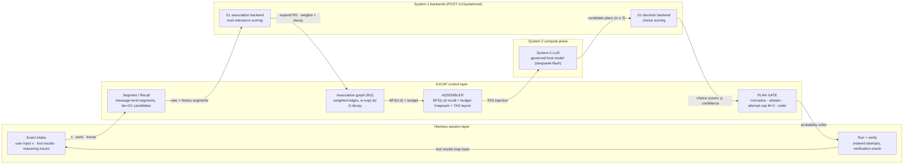

# S1CAP Architecture — Modules and Connections

Reference for the connections drawn in the interactive route diagram
([`figures/s1cap-technical-route.html`](./figures/s1cap-technical-route.html), source
[`figures/s1cap-technical-route.json`](./figures/s1cap-technical-route.json), text form
[`figures/s1cap-technical-route.mmd`](./figures/s1cap-technical-route.mmd)).

Status legend: **✅ implemented (M0)** · **🔜 planned (M1/M2)** · **◻ external**.

---

## 1. Diagram (Mermaid)

## 2. Connections (edge semantics)

| # | From → To | Payload | Mechanism |
|---|---|---|---|
| e1 | Event intake → Segment / Recall | new session event | every append to the session log is segmented (message level) |
| e2 | Segment / Recall → S1 association backend | new segment × history segments | tier-1 candidate generation: batched `noul` questions, ≤ 20 per call |
| e9 | S1 association backend → Association graph | edge weights + decay metadata | tier-2 verified edges are written into the RG |
| e3 | Association graph → ASSEMBLER | bounded recall set | `recall(seeds, {tau, depth, fanout})` then budget knapsack |
| e4 | ASSEMBLER → System-2 LLM | assembled prompt | Trace-as-State layout `[pinned \| T \| recalled \| tail \| x]`; model view only |
| e5 | System-2 LLM → S1 decision backend | candidate plans (m ≤ 3) | plans go **directly** to the decision backend for choice scoring |
| e10 | S1 decision backend → PLAN GATE | probabilities + confidence | gate consumes scores; it does not call System-1 itself |
| e7 | PLAN GATE → Run + verify | ordered plan list | attempt controller: probability order, cap **M = 2** |
| e8 | Run + verify → Event intake | tool results | results re-enter as new session events (turn loop) |

## 3. Modules

| Module | Responsibility | Inputs | Outputs | Key parameters | Degradation | Status · code |
|---|---|---|---|---|---|---|
| **Event intake** | Harness adapter: turn session events into `RawEvent`; write the assembled context back to the **model view only** (user transcript stays chronological) | harness event stream (append-only log) | `RawEvent` → Segment / Recall; surface rewrite ops | — | plugin load failure → native harness behaviour | 🔜 M1 · `packages/dsh-plugin`, `packages/proxy` |
| **Segment / Recall** | Split each event into **message-level** segments (never token-level); generate relevance candidates | `RawEvent` | `Segment[]`, candidate edge list | `chunkTokens=512`, `overlapTokens=64`; tier-1 = `embed` (ANN top-k=32) or `s1`; `questionsPerCall ≤ 20` | tier-1 unavailable → tier-0 metadata only | ✅ segmenter · `packages/core/src/segmenter.ts`; 🔜 tier-1 orchestration |
| **S1 association backend** | Score relevance of new segment × history segments; produce the weights that expand the RG | segment pair batches | relevance probabilities | `noul` questions, batched; `timeoutMs=2500` | timeout → skip tier-2 for that turn; hard down → tier-0 + recency window | ✅ client · `packages/s1-client`; 🔜 orchestration |
| **Association graph (RG)** | Store segment nodes and weighted edges; answer bounded recalls | verified edges | nodes, edges, recall hits | `tau=0.55`, `depth=2`, `fanout=8`, decay `λ=30 min` | thin recall → recency-window fallback | ✅ M0 · `packages/core/src/assoc-graph.ts` (in-memory; SQLite 🔜 M1) |
| **ASSEMBLER** | Decide what the model sees and in what order, under a token budget | RG recall hits, pinned prefix, tail, `x`, state proxy `T` | `AssemblyResult` (layout + budget accounting) | `B = contextWindow − reserveOutput − fixedOverhead`; `ρ=0.35`; `μ=0.25`; `tail K=3`; `tMaxChars=8000`; `updatePolicy=perTask` | recalled mass < `μ·budget` → `fallback: recency-window` | ✅ M0 · `packages/core/src/assembler.ts` |
| **System-2 LLM** | Governed host model: consumes the assembled context, emits reasoning and candidate plans, issues tool calls | assembled prompt | plans, tool calls | `deepseek-flash`, temperature 0; swap check with GLM-5.3 | provider error → harness retry/compaction path | ◻ external |
| **S1 decision backend** | Score candidate plans once as a `choice` question; return probabilities + confidence | plan summaries (≤ 8 options) | `{choice, probabilities, confidence}` | one call per plan set; abstain confidence `0.5` | low confidence → gate abstains and keeps the model order | ✅ client + normalization · `packages/s1-client`; 🔜 wiring M2 |
| **PLAN GATE** | Consume scores; normalize, abstain, cap attempts, order execution | probabilities + confidence | `{order, probs, abstained}` + plan-gate telemetry | normalize `p̂ = p / Σp`; cap `M=2`; plans `m ≤ 3` | no scores or conf < 0.5 → keep model order | ✅ M0 · `packages/core/src/plan-gate.ts` |
| **Run + verify** | Execute plans in the gate's order; verify each with the benchmark-native oracle; drop the rest on success | ordered plan list | tool calls, verification verdicts, tool results | attempt cap from the gate; approval waits excluded from timing | verification fails and cap not reached → next plan | 🔜 M2 · harness tools + `bench/runners` |
| **Telemetry** | Versioned JSONL record of the whole loop (cost, latency, quality inputs) | events from every module | JSONL rows, task summaries | schema v1 (fields are add-only); prices per provider | S1 outage recorded as `degraded` flag per call | ✅ M0 · `packages/core/src/telemetry.ts` |
| **Laya runtime** | Finds the Python environment that can `import laya`, launches `laya-serve`, health-checks `GET /v1/models`, stops it again | interpreter candidates (config → conda envs → PATH → `py -0p`) | running local server + status/logs | `pythonPath`, `condaEnv`, `host/port`, `startupTimeoutMs`, `env` (`LAYA_THREADS`, `HF_ENDPOINT`) | not ready → System-1 calls degrade to tier-0 + recency window | ✅ M0 · `packages/laya-runtime` |

## 4. The two System-1 intervention points

1. **Selective Context (context lifecycle)** — the association graph plus budgeted recall decides **what the model sees**; Trace-as-State ordering decides **in what order** (`[pinned | T | recalled | tail | x]`, `x` always last). The user-facing transcript is never rewritten.
2. **Adaptive Planning (decision priority)** — the decision backend scores candidate plans; the gate orders them and caps attempts. Unexecuted alternatives are discarded on first verified success.

## 5. Ablation mapping (cells ↔ modules)

| Module | C1 baseline | C2 +TAS | C3 +S1 | C4 full |
|---|---|---|---|---|
| Event intake / Segment | on | on | on | on |
| S1 association + RG + recall | off | off | **on** | **on** |
| ASSEMBLER (TAS layout) | off (chronological) | **on** | off (chronological) | **on** |
| S1 decision + PLAN GATE | off | off | **on** | **on** |
| Telemetry | on | on | on | on |

Cell presets: `bench/cells/C{1..4}.json`.
